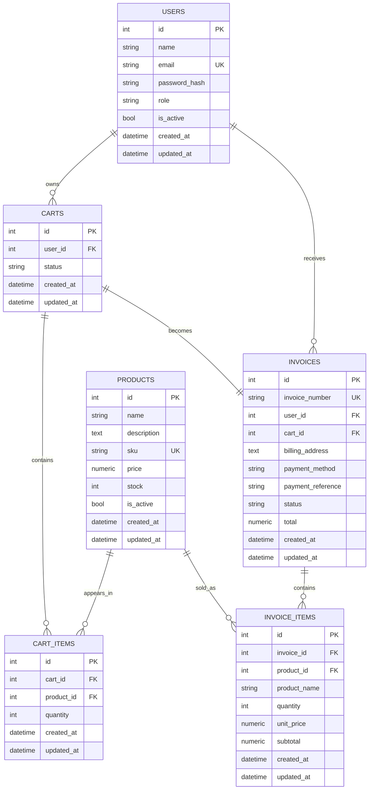

# Entity-Relationship Diagram

## Normalization

The database is separated by responsibility:

- `users` stores identity, credentials, and role information.
- `products` stores catalog data and current stock.
- `carts` represents a user's shopping cart, while `cart_items` stores added products without repeating columns.
- `invoices` stores the final sale, while `invoice_items` preserves the historical details of each sold product.

`invoice_items` stores `product_name`, `unit_price`, and `subtotal` even though it also references `products`. This preserves the historical value of a purchase if the product name or price changes after invoicing.

## Business Rules

- Only administrators can create, update, or deactivate users and products.
- Clients can read products and manage their own carts.
- An invoice can only be created from an owned, open cart that contains products.
- During checkout, the API validates stock and then reduces product stock.
- Only administrators can process refunds, and refunds restore product stock.
- User and product deletes are logical deletes through `is_active`, which preserves invoice history.

## Cache and Invalidation

Product read endpoints are cached because they are frequently requested and do not change on every request. They are invalidated when a product is created, updated, or deactivated, and also when a sale or refund changes stock.

Single-invoice reads are cached because invoice content is usually stable. The cache is invalidated when a refund is processed because the invoice status changes.
